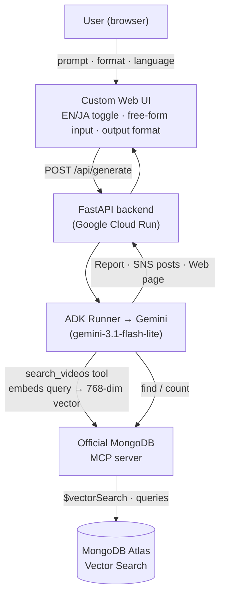
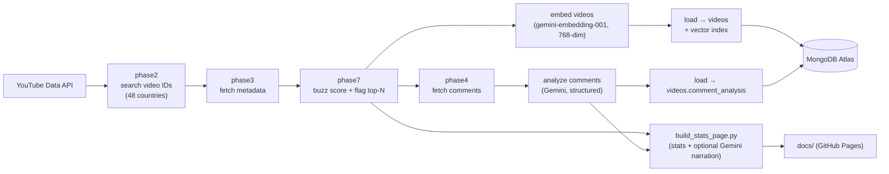

# SoccerScope  - powered by TubeSaku -

**SoccerScope is an AI agent that scouts the football (soccer) videos going viral *right now* across many countries, reads the room from fan comments, and writes it up — as a report, ready-to-post social drafts, or a shareable web page — in English or Japanese.**

It is built for independent sports journalists and creators chasing a fresh, cross-border angle — and for anyone who just wants a great story to bring to the table tomorrow.

> The agent goes beyond chat: from one plain-language request it plans the steps, runs a semantic search over a real video dataset through the **official MongoDB MCP server**, reads audience sentiment, and produces a finished deliverable.

---

## Architecture

### Live query path (the app)



**Key design choice:** the 768-dimension query vector is embedded inside a tool and passed *by code* straight to `$vectorSearch` via MCP — it never round-trips through the LLM. This keeps responses fast and stable, while every database read still flows through the partner MCP server (the integration requirement).

### Data pipeline (ingestion)



During the World Cup the pipeline is run **daily on a local machine** and writes into a **dedicated, configurable database** (set via the `DB_NAME` environment variable). Every load **upserts by `video_id`**, so daily re-runs are idempotent. The live data therefore refreshes daily throughout the tournament.

In addition to loading MongoDB, the daily run also regenerates a static public stats page (`docs/`, served via GitHub Pages) via `build_stats_page.py`. This script reads the same local JSON outputs (`phase7`, `comment_analysis`) — it does not query MongoDB. It optionally uses Gemini (`GEMINI_API_KEY`) to add a short bilingual blurb to the top videos; if the key is not set, it skips narration and still generates the page.

---

## Tech stack

- **Agent / LLM:** Google Agent Development Kit (ADK), Gemini `gemini-3.1-flash-lite`, `gemini-embedding-001` (768-dim, L2-normalized)
- **Partner integration (MCP):** official `mongodb-mcp-server` (Model Context Protocol)
- **Data store:** MongoDB Atlas + Atlas Vector Search
- **Backend / serving:** Python, FastAPI, Uvicorn, Docker, Google Cloud Run
- **Frontend:** HTML, CSS, vanilla JavaScript, `marked.js`, `DOMPurify`
- **Ingestion:** YouTube Data API v3, pymongo

---

## Repository layout

```
soccerscope-app/
├── app/
│   ├── main.py                 FastAPI: /api/generate + serves the UI
│   ├── soccer_agent/
│   │   ├── __init__.py         exports root_agent
│   │   ├── agent.py            ADK agent: search_videos + MongoDB MCP
│   │   └── .env.example        GOOGLE_API_KEY / MONGODB_URI / DB_NAME ...
│   ├── static/
│   │   └── index.html          custom web UI (EN/JA, form, output format)
│   ├── requirements.txt
│   └── Dockerfile              Python + Node 22 (MCP runs via npx)
├── pipeline/                   daily ingestion (run locally)
│   ├── phase2_collect_video_ids.py
│   ├── phase3_fetch_metadata.py
│   ├── phase7_calc_buzz_score.py
│   ├── phase4_fetch_comments.py
│   ├── 1_embed_videos.py
│   ├── 2_load_to_mongo.py
│   ├── 3_analyze_comments.py
│   ├── 4_load_comment_analysis.py
│   ├── api_utils.py            YouTube API retry / multi-key rotation
│   ├── countries.json          48-country master + per-language search words
│   ├── build_stats_page.py     generates the public docs/ stats page (uses Gemini optionally, see above)
│   └── pyproject.toml
├── docs/                       public stats page, served via GitHub Pages (generated by build_stats_page.py)
├── DEMO_SCRIPT.md
└── README.md
```

> Note: the `pipeline/` scripts above reflect the logical grouping; adjust paths to match your working tree.

---

## Run the app locally

Requires Python 3.10+ and Node.js v20.19+ / v22+.

```bash
cd soccerscope-app/app
python3 -m venv venv && . venv/bin/activate
pip install -r requirements.txt

cp soccer_agent/.env.example soccer_agent/.env
# edit soccer_agent/.env: GOOGLE_API_KEY and MONGODB_URI

python main.py            # open http://localhost:8080
```

## Deploy to Google Cloud Run

```bash
cd soccerscope-app/app
gcloud run deploy soccerscope \
  --source . \
  --region asia-northeast1 \
  --allow-unauthenticated \
  --clear-base-image \
  --memory 512Mi --cpu 1 --timeout 300 \
  --set-env-vars "GOOGLE_API_KEY=...,GOOGLE_GENAI_USE_VERTEXAI=FALSE,MONGODB_URI=mongodb+srv://...,DB_NAME=soccertube"
```

`--memory 512Mi --cpu 1 --timeout 300` are Cloud Run's own defaults — they are written out explicitly here to make the intended minimum footprint clear, rather than relying on defaults that could change. Increase them if traffic grows enough to need it.

To point the app at the daily-updated live database, deploy with `DB_NAME=<your-live-db>` (and `COLL_NAME` if different). Names default to `soccertube` / `videos` / `video_semantic_index` when unset.

### API

```
POST /api/generate
  { "query": "...", "format": "report|sns|webpage", "lang": "ja|en" }
→ { "format": "...", "lang": "...", "content": "<markdown or posts>" }

GET /healthz → {"status":"ok","agent":"soccer_agent"}
```

---

## Daily data update (during the World Cup)

Run the ingestion pipeline locally, targeting the live database via environment variables:

```bash
cd soccerscope-app/pipeline
export YOUTUBE_API_GLC_KEY=...   # YouTube Data API
export GEMINI_API_KEY=...        # embeddings + comment analysis (+ optional stats-page narration)
export MONGODB_URI=mongodb+srv://...
export DB_NAME=soccertube_live   # write to the dedicated live DB
export COLL_NAME=videos

python phase2_collect_video_ids.py --days 2
python phase3_fetch_metadata.py
python phase7_calc_buzz_score.py
python phase4_fetch_comments.py
python 1_embed_videos.py
python 2_load_to_mongo.py         # creates the vector index on first run
python 3_analyze_comments.py
python 4_load_comment_analysis.py
python build_stats_page.py        # regenerates the public docs/ stats page
```

Quotas to keep in mind: YouTube `search.list` costs 100 units/call (≈100 searches/day on the default 10k quota), and the embedding/analysis steps consume Gemini quota. Free-tier MongoDB Atlas (M0) allows up to **3 search indexes per cluster**, so ensure a free slot before creating the live collection's index.

---

## Demo site

[SOCCER·SCOPE](https://soccer.tubesaku.com/)  
Powerd by [tubesaku:YouTube data analysis tool provider website](https://tubesaku.com/)

## License

MIT — see [LICENSE](./LICENSE).
